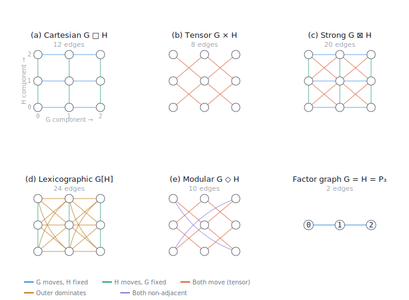

# Graph products: a reference for programmers and physicists

Graph products are constructions that combine two graphs $G$ and $H$ into a new, larger graph.
All five products described here share the same vertex set — the Cartesian product of the vertex sets of the two **factors** (the input graphs):

$$V(G \star H) = V(G) \times V(H) = \{(u, v) \mid u \in V(G),\; v \in V(H)\}$$

If $|V(G)| = n$ and $|V(H)| = m$, the product graph always has exactly $n \cdot m$ vertices.
Each vertex is a pair $(u, v)$, where $u$ is a vertex in $G$ (the **first component**) and $v$ is a vertex in $H$ (the **second component**).

What distinguishes the five products is their **edge set** — specifically, the predicate that determines when two product vertices $`(u_1, v_1)`$ and $`(u_2, v_2)`$ are adjacent.
All definitions below assume simple, undirected, unweighted graphs (no self-loops, no parallel edges, no directed arcs), which is the standard setting in the literature and where the cleanest theorems live.
The constructions generalize naturally to directed and weighted graphs.


## Terminology

See the [Graph Theory Glossary](graph-theory-glossary.md) for definitions of all graph-theoretic terms used here, including graph, adjacency, degree, path, bipartite, and adjacency matrix.


## Reading the notation

The formal definitions that follow all take the same shape:

$$\big(u_1, v_1\big) \sim_{G \star H} \big(u_2, v_2\big) \iff \text{(predicate involving } u_1, u_2, v_1, v_2\text{)}$$

Reading it from left to right:

- $`(u_1, v_1)`$ and $`(u_2, v_2)`$ are two vertices in the product graph.
  The subscripts 1 and 2 are labels distinguishing "the first vertex we're testing" from "the second."
  They are not indices that range over anything.

- $`\sim_{G \star H}`$ is the adjacency relation in the product graph.
  The subscript on $\sim$ specifies *which graph's* adjacency is meant — necessary because the expression involves three graphs ($G \star H$, $G$, and $H$), each with its own edge set.

- $\iff$ means "if and only if" — the edge exists exactly when the predicate on the right evaluates to true.

- The right-hand side is a Boolean expression built from:
  - $`u_1 \sim_G u_2`$ — adjacency in factor $G$ ("there is an edge between $`u_1`$ and $`u_2`$ in $G$")
  - $`v_1 \sim_H v_2`$ — adjacency in factor $H$
  - $`u_1 = u_2`$ — the first components are the same vertex ("this component didn't change")
  - $\land$ — logical AND
  - $\lor$ — logical OR
  - $\lnot$ — logical NOT
  - $\not\sim$ — negation of adjacency ("not adjacent"; shorthand for $\lnot(u_1 \sim u_2)$)

All four variables $`u_1, v_1, u_2, v_2`$ are bound once on the left-hand side.
The $\lor$ and $\land$ operators do not create new scopes — every occurrence of $`u_1`$ in the expression refers to the same vertex.
This is analogous to a function signature in code:

```python
def adjacent_in_product(u1, v1, u2, v2):
    return (predicate using u1, v1, u2, v2)
```


## The five graph products

Throughout this section, $G$ has $n$ vertices and $`e_G`$ edges; $H$ has $m$ vertices and $`e_H`$ edges.


### Cartesian product $G \square H$

**Predicate.** Exactly one component traverses an edge in its factor; the other stays fixed.

**Formal definition.**

$$(u_1, v_1) \sim_{G \square H} (u_2, v_2) \iff (u_1 = u_2 \;\land\; v_1 \sim_H v_2) \;\lor\; (u_1 \sim_G u_2 \;\land\; v_1 = v_2)$$

**As code.**

```python
def cartesian_adjacent(u1, v1, u2, v2):
    return (u1 == u2 and adj_H(v1, v2)) or (adj_G(u1, u2) and v1 == v2)
```

**Edge count.**

$$|E(G \square H)| = m \cdot e_G + n \cdot e_H$$

**Key properties.**
Commutative and associative.
The adjacency matrix decomposes as a Kronecker sum:

$$A^{G \square H} = A^{(G)} \otimes I_m + I_n \otimes A^{(H)}$$

This is the same structure as combining two independent Hamiltonians on different subsystems.
The spectrum of the adjacency matrix is $`\{\lambda_i + \mu_j\}`$ where $`\lambda_i`$ and $`\mu_j`$ are eigenvalues of $G$ and $H$.
The graph Laplacian decomposes the same way: $`L(G \square H) = L(G) \otimes I_m + I_n \otimes L(H)`$.

Every connected graph has a unique prime factorization with respect to the Cartesian product (the Sabidussi–Vizing theorem), and the factorization can be found in polynomial time.

**Example.** $`P_m \square P_n`$ is the $m \times n$ lattice graph. The hypercube $`Q_n`$ is the Cartesian product of $n$ copies of $`K_2`$. This is the product implicit in discretizing a PDE on a rectangular grid.


### Tensor product $G \times H$

Also called the categorical product, Kronecker product, or direct product.

**Predicate.** Both components simultaneously traverse edges in their respective factors.

**Formal definition.**

$$(u_1, v_1) \sim_{G \times H} (u_2, v_2) \iff u_1 \sim_G u_2 \;\land\; v_1 \sim_H v_2$$

**As code.**

```python
def tensor_adjacent(u1, v1, u2, v2):
    return adj_G(u1, u2) and adj_H(v1, v2)
```

**Edge count.**

$$|E(G \times H)| = 2 \cdot e_G \cdot e_H$$

**Key properties.**
Commutative and associative.
The adjacency matrix is the Kronecker product:

$$A^{G \times H} = A^{(G)} \otimes A^{(H)}$$

The spectrum is $`\{\lambda_i \cdot \mu_j\}`$.

The tensor product of two connected graphs can be disconnected.
Specifically, it is connected if and only if both factors are connected and at least one is non-bipartite.
For instance, $`P_3 \times P_3`$ is disconnected because path graphs are bipartite.

**Example.** In quantum information, the tensor product graph describes the interaction structure of independent product states.


### Strong product $G \boxtimes H$

**Predicate.** Each component either stays fixed or traverses an edge, but not both fixed simultaneously.

**Formal definition.**

$$(u_1, v_1) \sim_{G \boxtimes H} (u_2, v_2) \iff (u_1 \sim_G u_2 \;\lor\; u_1 = u_2) \;\land\; (v_1 \sim_H v_2 \;\lor\; v_1 = v_2) \;\land\; \lnot(u_1 = u_2 \;\land\; v_1 = v_2)$$

**As code.**

```python
def strong_adjacent(u1, v1, u2, v2):
    g_ok = adj_G(u1, u2) or u1 == u2
    h_ok = adj_H(v1, v2) or v1 == v2
    not_same = not (u1 == u2 and v1 == v2)
    return g_ok and h_ok and not_same
```

**Edge count.**

$$|E(G \boxtimes H)| = m \cdot e_G + n \cdot e_H + 2 \cdot e_G \cdot e_H$$

**Relationship to Cartesian and tensor products.**
The edge set is exactly the union:

$$E(G \boxtimes H) = E(G \square H) \;\cup\; E(G \times H)$$

This can be verified by distributing the first two clauses of the predicate using $\land$ over $\lor$, which yields four terms — one for the tensor product, two for the Cartesian product, and one self-loop term eliminated by the $\lnot$ clause.
The edge count formula is visibly the sum of the Cartesian and tensor formulas.

**Key properties.**
Commutative and associative.
The Shannon capacity of a graph $G$, denoted $\Theta(G)$, is defined via the strong product: $`\Theta(G) = \sup_n \alpha(G^{\boxtimes n})^{1/n}`$, where $\alpha$ is the independence number.
Lovász's theta function $\vartheta(G)$ was introduced to bound $`\Theta(C_5)`$ through this connection.

**Example.** $`P_m \boxtimes P_n`$ is the $m \times n$ lattice with diagonal connections — the 8-neighbor grid (king graph).


### Lexicographic product $G[H]$

Also called graph composition.

**Predicate.** If the $G$-components are adjacent, connect regardless of $H$. Otherwise, require the same $G$-component and adjacent $H$-components.

**Formal definition.**

$$(u_1, v_1) \sim_{G[H]} (u_2, v_2) \iff u_1 \sim_G u_2 \;\lor\; (u_1 = u_2 \;\land\; v_1 \sim_H v_2)$$

**As code.**

```python
def lexicographic_adjacent(u1, v1, u2, v2):
    return adj_G(u1, u2) or (u1 == u2 and adj_H(v1, v2))
```

**Edge count.**

$$|E(G[H])| = m^2 \cdot e_G + n \cdot e_H$$

The $`m^2 \cdot e_G`$ term reflects the fact that when $`u_1 \sim_G u_2`$, all $m^2$ pairs of second-component vertices are connected, not just the $`2 e_H`$ pairs adjacent in $H$.

**Key properties.**
Associative but **not commutative** — the only asymmetric product among the five.
The notation $G[H]$ uses brackets rather than an infix operator to signal that $G$ and $H$ play different roles: $G$ is the "outer" (coarse) structure, $H$ is the "inner" (fine) structure.
Conceptually, each vertex of $G$ is replaced by a copy of $H$, and all inter-copy edges are added wherever $G$ has an edge.

The asymmetry is visible in the edge count: swapping the factors gives $`|E(H[G])| = n^2 \cdot e_H + m \cdot e_G`$, which is different from $`m^2 \cdot e_G + n \cdot e_H`$ unless $n = m$ and $`e_G = e_H`$.


### Modular product $G \diamond H$

**Predicate.** The adjacency relations in the two factors must agree — both adjacent or both non-adjacent — with both components required to change.

**Formal definition.**

$$(u_1, v_1) \sim_{G \diamond H} (u_2, v_2) \iff \big(u_1 \sim_G u_2 \;\land\; v_1 \sim_H v_2\big) \;\lor\; \big(u_1 \not\sim_G u_2 \;\land\; v_1 \not\sim_H v_2\big)$$

with the constraint $u_1 \neq u_2$ and $v_1 \neq v_2$.

**As code.**

```python
def modular_adjacent(u1, v1, u2, v2):
    if u1 == u2 or v1 == v2:
        return False
    return adj_G(u1, u2) == adj_H(v1, v2)
```

Note the Python code distills the two $\lor$ clauses into a single equality test on Boolean values — if both adjacency tests return the same truth value, the predicate is satisfied.
This is the XNOR operation:

$$(a \;\land\; b) \;\lor\; (\lnot a \;\land\; \lnot b) \;=\; \lnot(a \oplus b)$$

where $`a = \text{adj}_G(u_1, u_2)`$ and $`b = \text{adj}_H(v_1, v_2)`$.

**Edge count.** No closed-form in terms of $n$, $m$, $`e_G`$, $`e_H`$ alone — the count depends on the complement structure of both factors. The tensor contribution is $`2 \cdot e_G \cdot e_H`$; the non-adjacency contribution depends on the number of non-edges.

**The $\neq$ constraints.**
These are necessary because in a simple graph, two identical vertices are not adjacent ($u \not\sim u$, since there are no self-loops).
Without the $\neq$ constraints, the second clause would fire for any pair sharing a component (e.g., $`(u, v_1)`$ and $`(u, v_2)`$ with $u \not\sim u$ and $`v_1 \not\sim v_2`$), creating spurious edges.

**Key properties.**
Commutative (XNOR is symmetric in its arguments).
A clique in $G \diamond H$ corresponds to a common induced subgraph of $G$ and $H$.
The maximum common induced subgraph problem therefore reduces to maximum clique in the modular product — both NP-hard, but useful because max-clique has well-developed solvers.


## Summary comparison

### Edge predicates

| Product | Symbol | Predicate (words) | Boolean analogy |
|---|---|---|---|
| Cartesian | $G \square H$ | Exactly one component moves | XOR-like (with equality) |
| Tensor | $G \times H$ | Both components move | AND |
| Strong | $G \boxtimes H$ | At least one component moves | OR |
| Lexicographic | $G[H]$ | Outer moves (don't care), or inner moves (outer fixed) | Outer dominates |
| Modular | $G \diamond H$ | Both agree (both adjacent or both not) | XNOR |

### Edge counts

| Product | $\|E\|$ |
|---|---|
| Cartesian | $`m \cdot e_G + n \cdot e_H`$ |
| Tensor | $`2 \cdot e_G \cdot e_H`$ |
| Strong | $`m \cdot e_G + n \cdot e_H + 2 \cdot e_G \cdot e_H`$ |
| Lexicographic | $`m^2 \cdot e_G + n \cdot e_H`$ |
| Modular | depends on complement structure |

### Symmetry and algebraic properties

| Product | Commutative | Associative | Adjacency matrix |
|---|---|---|---|
| Cartesian | yes | yes | $A^{(G)} \otimes I + I \otimes A^{(H)}$ (Kronecker sum) |
| Tensor | yes | yes | $A^{(G)} \otimes A^{(H)}$ (Kronecker product) |
| Strong | yes | yes | sum of Cartesian and tensor matrices |
| Lexicographic | **no** | yes | — |
| Modular | yes | — | — |

### Set-theoretic relationships

$$E(G \times H) \;\subset\; E(G \boxtimes H)$$
$$E(G \square H) \;\subset\; E(G \boxtimes H)$$
$$E(G \boxtimes H) \;=\; E(G \square H) \;\cup\; E(G \times H)$$
$$E(G \times H) \;\subset\; E(G \diamond H)$$


## Concrete example: $`P_3 \square P_3`$

Let both factors be the path graph on three vertices: $`G = H = P_3`$, with $V = \{0, 1, 2\}$ and $E = \{\{0,1\},\, \{1,2\}\}$.
The product graph has $3 \times 3 = 9$ vertices, naturally arranged in a grid where the first component indexes the column and the second component indexes the row.



| Product | Edges | Visual character |
|---|---|---|
| Cartesian | 12 | The $3 \times 3$ grid: horizontal and vertical moves only |
| Tensor | 8 | All short diagonals; disconnected (both factors bipartite) |
| Strong | 20 | Grid plus diagonals: 8-connected king's moves |
| Lexicographic | 24 | Dense connections between adjacent columns; sparse within |
| Modular | 10 | Tensor diagonals plus two long diagonals connecting $(0,0) \leftrightarrow (2,2)$ and $(0,2) \leftrightarrow (2,0)$ |


## Generalisations

The standard definitions assume simple, undirected, unweighted graphs.
The constructions extend naturally:

**Directed graphs.** Replace $u_1 \sim u_2$ with directed arcs $u_1 \to u_2$; the predicates carry over directly.
The Kronecker product of adjacency matrices still works.
The tensor product of two DAGs is a DAG.

**Weighted graphs.** The choice of how to combine weights depends on the application.
For the Cartesian product, a natural assignment copies the weight from whichever factor's edge is traversed.
For the tensor product, the conventional choice is $`w = w_G \cdot w_H`$, consistent with the Kronecker product interpretation and with tensor products of operators in quantum mechanics.
In some optimization settings, additive combination ($`w = w_G + w_H`$) is more natural.

**Edge-labeled graphs.** Less standardised, but the products extend by pairing or combining labels.
This arises in automata theory, where the tensor product of labeled transition systems corresponds to intersection of languages.


## Notes on the modular product and the canonical four

The four products — Cartesian, tensor, strong, lexicographic — form a natural family.
They are the products generated by Boolean combinations of the two conditions "$u_1 \sim_G u_2$" and "$v_1 \sim_H v_2$" together with equality conditions $u_1 = u_2$ and $v_1 = v_2$.

The modular product breaks out of this framework by involving $\not\sim$, which references the **complement** of each factor's edge set.
This is why it is less commonly listed among "the standard graph products," despite having important algorithmic applications (particularly the reduction from maximum common induced subgraph to maximum clique).
